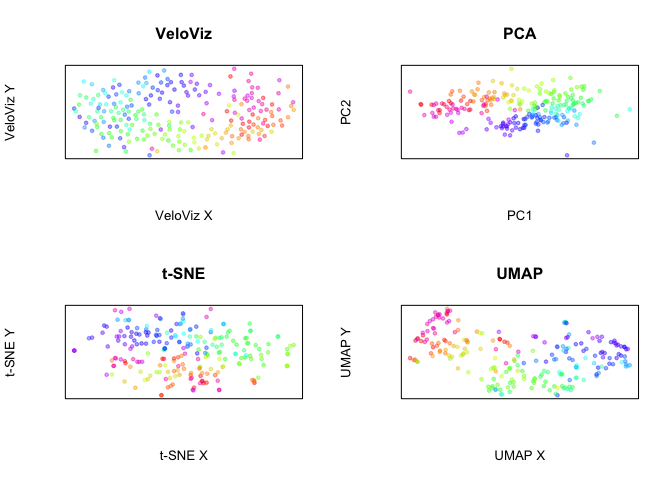
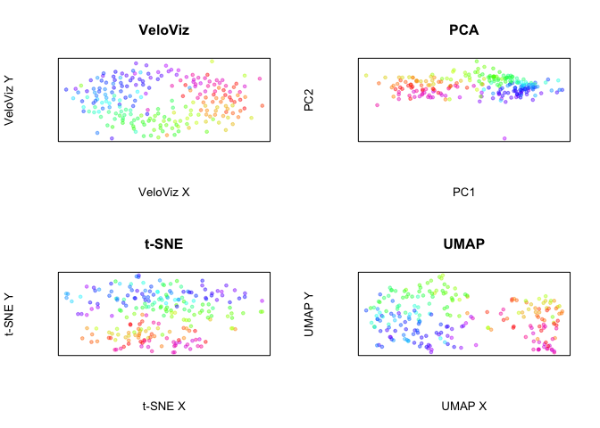
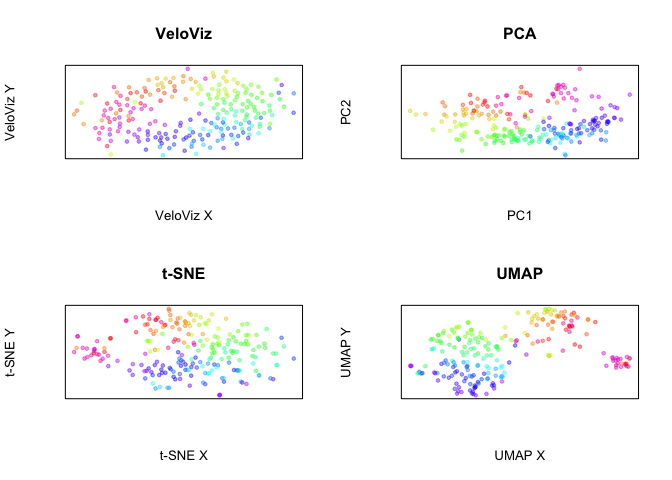
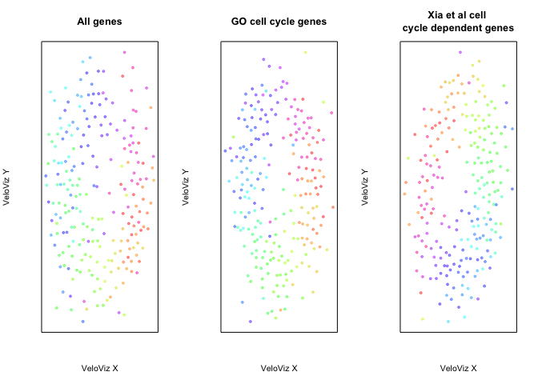

Visualizing MERFISH data using VeloViz
======================================

In this vignette, we will use VeloViz to create a 2D embedding to
visualize MERFISH data collected from U-2 OS cells in culture. Since
this data comes from a cell line in culture, we expect the main temporal
signal to be progression throught the cell-cycle. We will compare the
VeloViz embedding to simply using the first two principal components. We
will also compare the results we get when we restrict the input genes.
The data used for this example was initially obtained from the Xia et. al., *PNAS*, 2019. An R object containing the preprocessed example data is available at [Zenodo](https://doi.org/10.5281/zenodo.4632471)

Load data
---------

MERFISH data from Xia et. al., *PNAS*, 2019. This data is provided with
the VeloViz package. Since this data doesn’t distinguish between spliced
and unspliced RNAs, we insteda use cytplasmic and nuclear counts to
calculate velocity.

    library(veloviz)
    library(velocyto.R)

    # get MERFISH data
    download.file("https://zenodo.org/record/4632471/files/MERFISH.rda?download=1", destfile = "MERFISH.rda", method = "curl")
    load("MERFISH.rda")

    col <- MERFISH$col #colors based on louvain clusters
    pcs <- MERFISH$pcs

    cyto <- MERFISH$cyto #cytplasmic counts
    nuc <- MERFISH$nuc #nuclear counts

Using all genes
---------------

### Velocity

    cell.dists <- as.dist(1-cor(t(pcs))) #distances in PC space - used for velocity
    vel <- velocyto.R::gene.relative.velocity.estimates(as.matrix(cyto),
                                                        as.matrix(nuc), kCells = 30,
                                                        cell.dist = cell.dists,
                                                        fit.quantile = 0.1)

    #(or use precomputed velocity)
    #vel <- MERFISH$vel

    curr <- vel$current
    proj <- vel$projected

### Build VeloViz embedding

    veloviz <-  buildVeloviz(curr = curr, proj = proj,
                             normalize.depth = TRUE,
                             use.ods.genes = FALSE,  
                             pca = TRUE, nPCs = 3,
                             center = TRUE, scale = TRUE,
                             k = 50, similarity.threshold = -1,
                             distance.weight = 1, distance.threshold = 1,
                             weighted = TRUE, seed = 0, verbose = FALSE)

    emb.veloviz <- veloviz$fdg_coords

### Other embeddings

    #PCA - we've already computed PCs
    emb.pca <- pcs[,1:2]

    #t-SNE
    set.seed(0)
    emb.tsne <- Rtsne::Rtsne(pcs, pca=FALSE)$Y
    rownames(emb.tsne) <- rownames(pcs)

    #UMAP
    set.seed(0)
    emb.umap <- uwot::umap(pcs)
    rownames(emb.umap) <- rownames(pcs)

Now, plot all embeddings

    par(mfrow = c(2,2))

    plotEmbedding(emb.veloviz, colors = col[rownames(emb.veloviz)],
                  main = 'VeloViz', xlab = "VeloViz X", ylab = "VeloViz Y")
    plotEmbedding(emb.pca, colors = col,
                  main = 'PCA', xlab = "PC1", ylab = "PC2")
    plotEmbedding(emb.tsne, colors = col,
                  main = 't-SNE', xlab = "t-SNE X", ylab = "t-SNE Y")
    plotEmbedding(emb.umap, colors = col,
                  main = 'UMAP', xlab = "UMAP X", ylab = "UMAP Y")

Using GO cell cycle genes
-------------------------

Now let’s compare these embeddings to embeddings created using only cell
cycle genes in the GO mitotic cell-cycle gene set.

    #GO cell cycle genes (GO:0000278)
    # https://www.gsea-msigdb.org/gsea/msigdb/cards/GO_MITOTIC_CELL_CYCLE
    cycle.genes.go <- read.csv("GO_0000278.csv",header = FALSE)$V1
    cycle.genes.go <- intersect(cycle.genes.go, rownames(nuc)) #GO cell cycle genes that are in MERFISH data

    cyto.go <- cyto[cycle.genes.go,]
    nuc.go <- nuc[cycle.genes.go,]

Compute new PCs..

    all.go <- cyto.go + nuc.go
    #normalize and dim red
    cpm <- normalizeDepth(all.go)
    lognorm <- log10(cpm+1)
    pcs.go <- veloviz::reduceDimensions(lognorm, center = T, scale = T)
    cell.dist <- as.dist(1-cor(t(pcs.go)))

### Velocity

    vel.go <- velocyto.R::gene.relative.velocity.estimates(as.matrix(cyto.go),
                                                        as.matrix(nuc.go), kCells = 30,
                                                        cell.dist = cell.dists,
                                                        fit.quantile = 0.1)
    curr.go <- vel.go$current
    proj.go <- vel.go$projected

### Build VeloViz embedding

    veloviz.go <-  buildVeloviz(curr = curr.go, proj = proj.go,
                             normalize.depth = TRUE,
                             use.ods.genes = FALSE,  
                             pca = TRUE, nPCs = 3,
                             center = TRUE, scale = TRUE,
                             k = 50, similarity.threshold = -1,
                             distance.weight = 1, distance.threshold = 1,
                             weighted = TRUE, seed = 0, verbose = FALSE)

    emb.veloviz.go <- veloviz.go$fdg_coords

### Other embeddings

    #PCA - we've already computed PCs
    emb.pca.go <- pcs.go[,1:2]

    #t-SNE
    set.seed(0)
    emb.tsne.go <- Rtsne::Rtsne(pcs.go, pca=FALSE)$Y
    rownames(emb.tsne.go) <- rownames(pcs.go)

    #UMAP
    set.seed(0)
    emb.umap.go <- uwot::umap(pcs.go)
    rownames(emb.umap.go) <- rownames(pcs.go)

Now, plot all embeddings

    par(mfrow = c(2,2))

    plotEmbedding(emb.veloviz.go, colors = col[rownames(emb.veloviz.go)],
                  main = 'VeloViz', xlab = "VeloViz X", ylab = "VeloViz Y")
    plotEmbedding(emb.pca.go, colors = col,
                  main = 'PCA', xlab = "PC1", ylab = "PC2")
    plotEmbedding(emb.tsne.go, colors = col,
                  main = 't-SNE', xlab = "t-SNE X", ylab = "t-SNE Y")
    plotEmbedding(emb.umap.go, colors = col,
                  main = 'UMAP', xlab = "UMAP X", ylab = "UMAP Y")

Using genes with cell cycle dependent expression
------------------------------------------------

Xia et. al. identified genes with cell cycle dependent expression. Let’s
construct the embeddings with only those genes.

    #MERFISH genes exhibiting cell-cycle-dependent expression (Xia et al 2019, Supp Dataset 8)
    # https://www.pnas.org/content/116/39/19490
    cycle.genes.xia <- read.csv("pnas_sd08.csv",header = TRUE)$Gene
    cycle.genes.xia <- intersect(cycle.genes.xia, rownames(nuc)) #genes that are also in MERFISH data

    cyto.xia <- cyto[cycle.genes.xia,]
    nuc.xia <- nuc[cycle.genes.xia,]

Compute new PCs..

    all.xia <- cyto.xia + nuc.xia
    #normalize and dim red
    cpm <- normalizeDepth(all.xia)
    lognorm <- log10(cpm+1)
    pcs.xia <- veloviz::reduceDimensions(lognorm, center = T, scale = T)
    cell.dist <- as.dist(1-cor(t(pcs.xia)))

### Velocity

    vel.xia <- velocyto.R::gene.relative.velocity.estimates(as.matrix(cyto.xia),
                                                        as.matrix(nuc.xia), kCells = 30,
                                                        cell.dist = cell.dists,
                                                        fit.quantile = 0.1)
    curr.xia <- vel.xia$current
    proj.xia <- vel.xia$projected

### Build VeloViz embedding

    veloviz.xia <-  buildVeloviz(curr = curr.xia, proj = proj.xia,
                             normalize.depth = TRUE,
                             use.ods.genes = FALSE,  
                             pca = TRUE, nPCs = 3,
                             center = TRUE, scale = TRUE,
                             k = 50, similarity.threshold = -1,
                             distance.weight = 1, distance.threshold = 1,
                             weighted = TRUE, seed = 0, verbose = FALSE)

    emb.veloviz.xia <- veloviz.xia$fdg_coords

### Other embeddings

    #PCA - we've already computed PCs
    emb.pca.xia <- pcs.xia[,1:2]

    #t-SNE
    set.seed(0)
    emb.tsne.xia <- Rtsne::Rtsne(pcs.xia, pca=FALSE)$Y
    rownames(emb.tsne.xia) <- rownames(pcs.xia)

    #UMAP
    set.seed(0)
    emb.umap.xia <- uwot::umap(pcs.xia)
    rownames(emb.umap.xia) <- rownames(pcs.xia)

Now, plot all embeddings

    par(mfrow = c(2,2))

    plotEmbedding(emb.veloviz.xia, colors = col[rownames(emb.veloviz.xia)],
                  main = 'VeloViz', xlab = "VeloViz X", ylab = "VeloViz Y")
    plotEmbedding(emb.pca.xia, colors = col,
                  main = 'PCA', xlab = "PC1", ylab = "PC2")
    plotEmbedding(emb.tsne.xia, colors = col,
                  main = 't-SNE', xlab = "t-SNE X", ylab = "t-SNE Y")
    plotEmbedding(emb.umap.xia, colors = col,
                  main = 'UMAP', xlab = "UMAP X", ylab = "UMAP Y")

Comparing VeloViz embeddings
----------------------------

VeloViz embeddings constructed with different gene sets

    par(mfrow = c(1,3))
    plotEmbedding(emb.veloviz, colors = col[rownames(emb.veloviz)],
                  main = 'All genes', xlab = "VeloViz X", ylab = "VeloViz Y")
    plotEmbedding(emb.veloviz.go, colors = col[rownames(emb.veloviz.go)],
                  main = 'GO cell cycle genes', xlab = "VeloViz X", ylab = "VeloViz Y")
    plotEmbedding(emb.veloviz.xia, colors = col[rownames(emb.veloviz.xia)],
                  main = 'Xia et al cell \ncycle dependent genes', xlab = "VeloViz X", ylab = "VeloViz Y")

## Other tutorials
[Getting Started](index) \
[scRNA-seq data preprocessing and visualization using VeloViz](pancreas)   
[Understanding VeloViz parameters](simulation) \
[Visualizing the VeloViz graph using UMAP](umap) \
[VeloViz with dynamic velocity estimates from scVelo](scVeloVignette)
