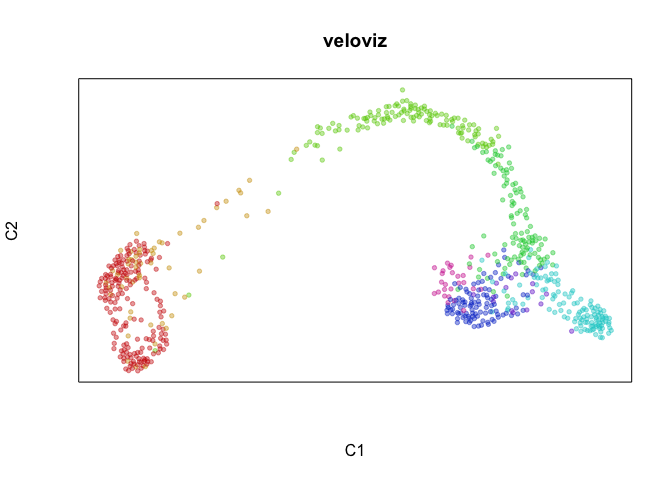
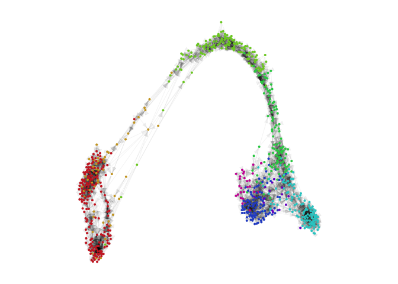
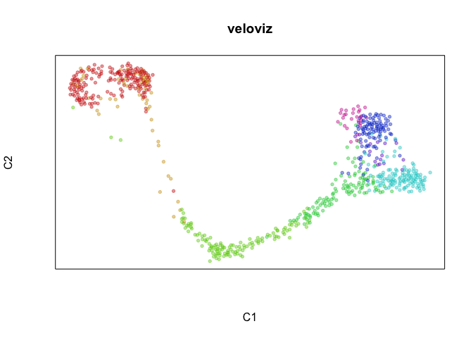
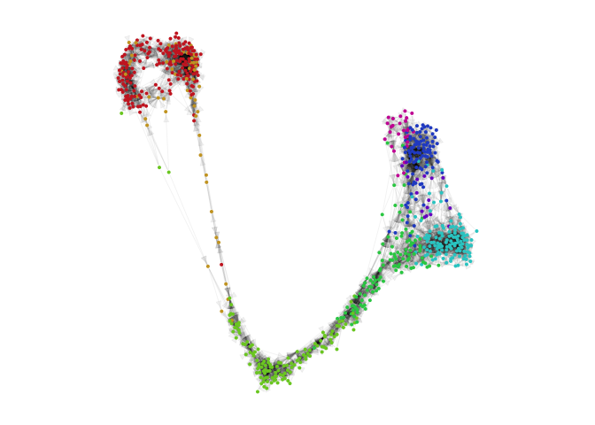
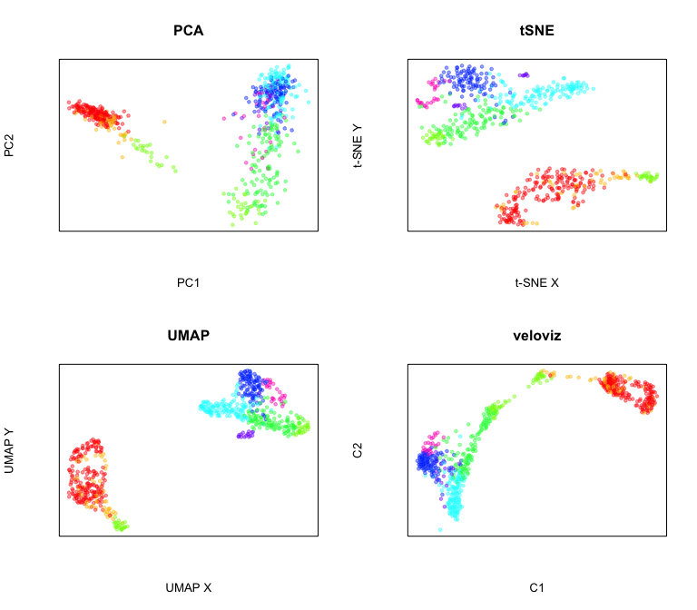

Visualization using VeloViz
===========================

In this tutorial, we will compare the velocity-informed 2D embedding
created by VeloViz to other commonly used embeddings. We will go through
the workflow needed to generate the VeloViz visualization using the
pancreas endocrinogenesis dataset as an example. We will also compare
results with VeloViz and other embeddings when some intermediate cells
in the developmental trajectory are missing.

Preprocessing
-------------

Inputs to VeloViz are the scores in PCA space of the current and
projected transcriptional states, which we get here by calculating RNA
velocity using velocyto.  
To get current and projected PC scores from raw counts, we first follow
standard filtering, normalization, and dimensional reduction steps and
then calculate velocity. (Steps 1-3 can be skipped by downloading the preprocessed example data from [Zenodo](https://doi.org/10.5281/zenodo.4632471) - see 3\*).

    library(veloviz)
    library(reticulate)
    library(velocyto.R)

0.) Get Data:

    #getting pancreas data from scVelo
    scv = import("scvelo")
    adata = scv$datasets$pancreas()

    #extract spliced, unspliced counts
    spliced <- as.matrix(Matrix::t(adata$layers['spliced']))
    unspliced <- as.matrix(Matrix::t(adata$layers['unspliced']))
    cells <- adata$obs_names$values
    genes <- adata$var_names$values
    colnames(spliced) <- colnames(unspliced) <- cells
    rownames(spliced) <- rownames(unspliced) <- genes

    #clusters
    clusters <- adata$obs$clusters
    names(clusters) <- adata$obs_names$values

    #subsample to make things faster
    set.seed(0)
    good.cells <- sample(cells, length(cells)/5)
    spliced <- spliced[,good.cells]
    unspliced <- unspliced[,good.cells]
    clusters <- clusters[good.cells]

    dim(spliced)
    dim(unspliced)

1.) Filter good genes

    #keep genes with >10 total counts
    good.genes = genes[rowSums(spliced) > 10 & rowSums(unspliced) > 10]
    spliced = spliced[good.genes,]
    unspliced = unspliced[good.genes,]

    dim(spliced)
    dim(unspliced)

2.) Normalize

    counts = spliced + unspliced # use combined spliced and unspliced counts
    cpm = normalizeDepth(counts) # normalize to counts per million
    lognorm = log10(varnorm + 1) # log normalize

3.) Reduce Dimensions  
After filtering and normalizing, we reduce dimensions, and calculate
cell-cell distance in PC space. This distance will be used to compute
velocity.

    #PCA on centered and scaled expression of overdispersed genes
    pcs = reduceDimensions(lognorm, center = TRUE, scale = TRUE, nPCs = 50)

    #cell distance in PC space
    cell.dist = as.dist(1-cor(t(pcs))) # cell distance in PC space

3\*) Download preprocessed data from [Zenodo](https://doi.org/10.5281/zenodo.4632471).

    # get pancreas scRNA-seq data
    download.file("https://zenodo.org/record/4632471/files/pancreas.rda?download=1", destfile = "pancreas.rda", method = "curl")
    load("pancreas.rda")

    spliced = pancreas$spliced
    unspliced = pancreas$unspliced
    clusters = pancreas$clusters
    pcs = pancreas$pcs

    #choose colors based on clusters for plotting later
    cell.cols = rainbow(8)[as.numeric(clusters)]
    names(cell.cols) = names(clusters)

Velocity
--------

4.) Calculate velocity  
Next, we compute velocity from spliced and unspliced counts and
cell-cell distances using velocyto. This will give us the current and
projected transcriptional states.

    #cell distance in PC space
    cell.dist = as.dist(1-cor(t(pcs))) # cell distance in PC space

    vel = gene.relative.velocity.estimates(spliced,
                                           unspliced,
                                           kCells = 30,
                                           cell.dist = cell.dist,
                                           fit.quantile = 0.1)

    #(or use precomputed velocity object)
    # vel = pancreas$vel

5.) Normalize current and projected  
Now that we have the current and projected expression, we want to go
through a similar normalization process as we did with the raw counts
and then reduce dimensions in PCA. Steps 5-7 can be done together using
the `buildVeloviz` function (see 7\*).

    curr = vel$current
    proj = vel$projected

    #normalize depth
    curr.norm = normalizeDepth(curr)
    proj.norm = normalizeDepth(proj)

    #variance stabilize current
    curr.varnorm.info = normalizeVariance(curr.norm, details = TRUE)
    curr.varnorm = curr.varnorm.info$matnorm

    #use same model for projected
    scale.factor = curr.varnorm.info$df$scale_factor #gene scale factors
    names(scale.factor) = rownames(curr.varnorm.info$df)

    m = proj.norm
    rmean = Matrix::rowMeans(m) #row mean
    sumx = Matrix::rowSums(m)
    sumxx = Matrix::rowSums(m^2)
    rsd = sqrt((sumxx - 2 * sumx * rmean + ncol(m) * rmean ^ 2) / (ncol(m)-1)) #row sd

    proj.varnorm = proj.norm / rsd * scale.factor[names(rsd)]
    proj.varnorm = proj.norm[rownames(curr.varnorm),]

6.) Project current and projected into PC space

    #log normalize
    curr.pca = log10(curr.varnorm + 1)
    proj.pca = log10(proj.varnorm + 1)

    #mean center
    c.rmean = Matrix::rowMeans(curr.pca)
    curr.pca = curr.pca - c.rmean
    p.rmean = Matrix::rowMeans(proj.pca)
    proj.pca = proj.pca - p.rmean

    #scale variance
    c.sumx = Matrix::rowSums(curr.pca)
    c.sumxx = Matrix::rowSums(curr.pca^2)
    c.rsd = sqrt((c.sumxx - 2*c.sumx*c.rmean + ncol(curr.pca)*c.rmean^2)/(ncol(curr.pca)-1))
    curr.pca = curr.pca/c.rsd

    p.sumx = Matrix::rowSums(proj.pca)
    p.sumxx = Matrix::rowSums(proj.pca^2)
    p.rsd = sqrt((p.sumxx - 2*p.sumx*p.rmean + ncol(proj.pca)*p.rmean^2)/(ncol(proj.pca)-1))
    proj.pca = proj.pca/p.rsd

    #PCA
    pca = RSpectra::svds(A = Matrix::t(curr.pca), k=20,
                         opts = list(
                           center = FALSE, ## already done
                           scale = FALSE, ## already done
                           maxitr = 2000,
                           tol = 1e-10))

    #scores of current and projected
    curr.scores = Matrix::t(curr.pca) %*% pca$v[,1:10]
    proj.scores = Matrix::t(proj.pca) %*% pca$v[,1:10]

VeloViz
-------

7.) Build graph using VeloViz  
Now we can use the PC projections of the current and projected
transcriptional states to build the VeloViz graph. To build the graph,
we have to specify multiple parameters that control the features of the
graph:  
**`k`**: how many out-edges each cell can have  
**`similarity_threshold`**: cosine similarity threshold specifying how
similar the velocity and cell transition vectors have to be for an
out-edge to be included  
**`distance_weight`**: weight for distance component of composite
distance - with large weights, graph will prioritize linking cells where
projected states and neighbors are close in PC space; with small
weights, graph will prioritize linking cells where velocity and cell
transition vectors are most similar  
**`distance_threshold`**: quantile threshold specifying minimum distance
in PC space between projected state and neighbor for out-edge to be
included - e.g. a distance threshold of 0.2 means that any edges where
the distance component is not in the smallest 20% of distances in PC
space will be removed from the graph  
**`weighted`**: whether to use composite distance to determine graph
edge weights (`TRUE`) or to assign all edges equal weights (`FALSE`)

    #VeloViz graph parameters
    k = 5
    similarity.threshold = 0.25
    distance.weight = 1
    distance.threshold = 0.5
    weighted = TRUE

    #build graph
    set.seed(0)
    veloviz = graphViz(t(curr.scores), t(proj.scores), k,
                       cell.colors=NA,
                       similarity_threshold=similarity.threshold,
                       distance_weight = distance.weight,
                       distance_threshold = distance.threshold,
                       weighted = weighted,
                       plot = FALSE,
                       return_graph = TRUE)

    emb.veloviz = veloviz$fdg_coords
    plotEmbedding(emb.veloviz, groups=clusters[rownames(emb.veloviz)], main='veloviz')

    par(mfrow=c(1,1), mar=rep(1,4))
    g = plotVeloviz(veloviz, clusters=clusters[rownames(emb.veloviz)], seed=0, verbose=TRUE)

7\*) Build VeloViz graph from current and projected using `buildVeloviz`

    curr = vel$current
    proj = vel$projected

    veloviz = buildVeloviz(
      curr = curr, proj = proj,
      normalize.depth = TRUE,
      use.ods.genes = TRUE,
      alpha = 0.05,
      pca = TRUE,
      nPCs = 20,
      center = TRUE,
      scale = TRUE,
      k = 5,
      similarity.threshold = 0.25,
      distance.weight = 1,
      distance.threshold = 0.5,
      weighted = TRUE,
      seed = 0,
      verbose = FALSE
    )

    emb.veloviz = veloviz$fdg_coords
    plotEmbedding(emb.veloviz, groups=clusters[rownames(emb.veloviz)], main='veloviz')

    par(mfrow=c(1,1), mar=rep(1,4))
    g = plotVeloviz(veloviz, clusters=clusters[rownames(emb.veloviz)], seed=0, verbose=TRUE)

Compare to other embeddings
---------------------------

    par(mfrow = c(2,2))

    #PCA
    emb.pca = pcs[,1:2]
    plotEmbedding(emb.pca, colors = cell.cols, main='PCA',
                  xlab = "PC1", ylab = "PC2")

    #tSNE
    set.seed(0)
    emb.tsne = Rtsne::Rtsne(pcs, perplexity=30)$Y
    rownames(emb.tsne) = rownames(pcs)
    plotEmbedding(emb.tsne, colors = cell.cols, main='tSNE',
                  xlab = "t-SNE X", ylab = "t-SNE Y")

    ##UMAP
    set.seed(0)
    emb.umap = uwot::umap(pcs, min_dist = 0.5)
    rownames(emb.umap) <- rownames(pcs)
    plotEmbedding(emb.umap, colors = cell.cols, main='UMAP',
                  xlab = "UMAP X", ylab = "UMAP Y")

    #veloviz
    plotEmbedding(emb.veloviz, colors = cell.cols[rownames(emb.veloviz)], main='veloviz')

Now let’s project velocity inferred from `velocyto.R` onto these
embeddings.

    par(mfrow = c(2,2))

    show.velocity.on.embedding.cor(scale(emb.pca), vel,
                                   n = 50,
                                   scale='sqrt',
                                   cex=1, arrow.scale=1, show.grid.flow=TRUE,
                                   min.grid.cell.mass=0.5, grid.n=30, arrow.lwd=1, do.par = FALSE,
                                   cell.colors=cell.cols, main='PCA')
    show.velocity.on.embedding.cor(scale(emb.tsne), vel,
                                   n = 50,
                                   scale='sqrt',
                                   cex=1, arrow.scale=1, show.grid.flow=TRUE,
                                   min.grid.cell.mass=0.5, grid.n=30, arrow.lwd=1,do.par = FALSE,
                                   cell.colors=cell.cols, main='tSNE')
    show.velocity.on.embedding.cor(scale(emb.umap), vel,
                                   n = 50,
                                   scale='sqrt',
                                   cex=1, arrow.scale=1, show.grid.flow=TRUE,
                                   min.grid.cell.mass=0.5, grid.n=30, arrow.lwd=1,do.par = FALSE,
                                   cell.colors=cell.cols, main='UMAP')
    show.velocity.on.embedding.cor(scale(emb.veloviz), vel,
                                   n = 50,
                                   scale='sqrt',
                                   cex=1, arrow.scale=1, show.grid.flow=TRUE,
                                   min.grid.cell.mass=0.5, grid.n=30, arrow.lwd=1,do.par = FALSE,
                                   cell.colors=cell.cols, main='VeloViz')

Visualization with missing intermediates using VeloViz
======================================================

Download data with missing intermediates: this is the same dataset as above but missing a proportion of
Ngn3 high EP cells

    # get data
    download.file("https://zenodo.org/record/4632471/files/pancreasWithGap.rda?download=1", destfile = "pancreasWithGap.rda", method = "curl")
    load("pancreasWithGap.rda")

    spliced = pancreasWithGap$spliced
    unspliced = pancreasWithGap$unspliced
    clusters = pancreasWithGap$clusters
    pcs = pancreasWithGap$pcs

    #choose colors based on clusters for plotting later
    cell.cols = rainbow(8)[as.numeric(clusters)]
    names(cell.cols) = names(clusters)

Compute velocity

    #cell distance in PC space
    cell.dist = as.dist(1-cor(t(pcs))) # cell distance in PC space

    vel = gene.relative.velocity.estimates(spliced,
                                           unspliced,
                                           kCells = 30,
                                           cell.dist = cell.dist,
                                           fit.quantile = 0.1)

    #(or use precomputed velocity object)
    # vel = pancreasWithGap$vel

Create VeloViz embedding

    curr = vel$current
    proj = vel$projected

    veloviz = buildVeloviz(
      curr = curr, proj = proj,
      normalize.depth = TRUE,
      use.ods.genes = TRUE,
      alpha = 0.05,
      pca = TRUE,
      nPCs = 20,
      center = TRUE,
      scale = TRUE,
      k = 5,
      similarity.threshold = 0.25,
      distance.weight = 1,
      distance.threshold = 0.5,
      weighted = TRUE,
      seed = 0,
      verbose = FALSE
    )

    emb.veloviz = veloviz$fdg_coords
    plotEmbedding(emb.veloviz, groups=clusters[rownames(emb.veloviz)], main='veloviz')

    par(mfrow=c(1,1), mar=rep(1,4))
    g = plotVeloviz(veloviz, clusters=clusters[rownames(emb.veloviz)], seed=0, verbose=TRUE)

Compare to other embeddings

    par(mfrow = c(2,2))

    #PCA
    emb.pca = pcs[,1:2]
    plotEmbedding(emb.pca, colors = cell.cols, main='PCA')

    #tSNE
    set.seed(0)
    emb.tsne = Rtsne::Rtsne(pcs, perplexity=30)$Y
    rownames(emb.tsne) = rownames(pcs)
    plotEmbedding(emb.tsne, colors = cell.cols, main='tSNE',
                  xlab = "t-SNE X", ylab = "t-SNE Y")

    ##UMAP
    set.seed(0)
    emb.umap = uwot::umap(pcs, min_dist = 0.5)
    rownames(emb.umap) <- rownames(pcs)
    plotEmbedding(emb.umap, colors = cell.cols, main='UMAP',
                  xlab = "UMAP X", ylab = "UMAP Y")

    #veloviz
    plotEmbedding(emb.veloviz, colors = cell.cols[rownames(emb.veloviz)], main='veloviz')

Now let’s project velocity inferred from `velocyto.R` onto these
embeddings.

    par(mfrow = c(2,2))

    show.velocity.on.embedding.cor(scale(emb.pca), vel,
                                   n = 50,
                                   scale='sqrt',
                                   cex=1, arrow.scale=1, show.grid.flow=TRUE,
                                   min.grid.cell.mass=0.5, grid.n=30, arrow.lwd=1, do.par = FALSE,
                                   cell.colors=cell.cols, main='PCA')
    show.velocity.on.embedding.cor(scale(emb.tsne), vel,
                                   n = 50,
                                   scale='sqrt',
                                   cex=1, arrow.scale=1, show.grid.flow=TRUE,
                                   min.grid.cell.mass=0.5, grid.n=30, arrow.lwd=1,do.par = FALSE,
                                   cell.colors=cell.cols, main='tSNE')
    show.velocity.on.embedding.cor(scale(emb.umap), vel,
                                   n = 50,
                                   scale='sqrt',
                                   cex=1, arrow.scale=1, show.grid.flow=TRUE,
                                   min.grid.cell.mass=0.5, grid.n=30, arrow.lwd=1,do.par = FALSE,
                                   cell.colors=cell.cols, main='UMAP')
    show.velocity.on.embedding.cor(scale(emb.veloviz), vel,
                                   n = 50,
                                   scale='sqrt',
                                   cex=1, arrow.scale=1, show.grid.flow=TRUE,
                                   min.grid.cell.mass=0.5, grid.n=30, arrow.lwd=1,do.par = FALSE,
                                   cell.colors=cell.cols, main='VeloViz')

## Other tutorials
[Getting Started](index) \
[MERFISH cell cycle visualization using VeloViz](merfish)  
[Understanding VeloViz parameters](simulation) \
[Visualizing the VeloViz graph using UMAP](umap) \
[VeloViz with dynamic velocity estimates from scVelo](scVeloVignette)
