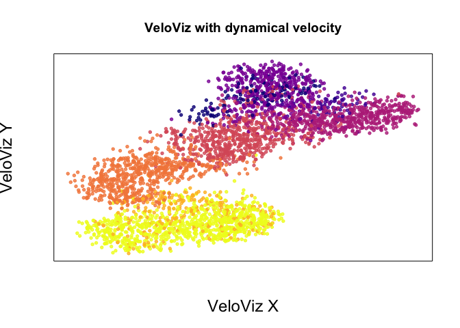
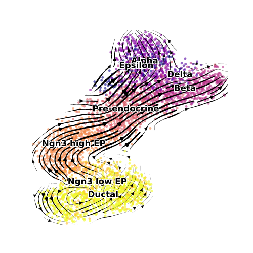

VeloViz with Dynamic Velocity Estimates
=======================================

In this vignette, we will create a velocity-informed 2D embedding of
pancreas development scRNAseq using VeloViz. We will use dynamic
velocity estimated using scVelo to construct the VeloViz embedding and
we will also use scVelo’s velocity streams to illustrate velocity on the
embedding. To do this in R, we will make use of the reticulate package
(see [this
tutorial](https://jef.works/blog/2020/08/25/using-scvelo-in-R-using-reticulate/)
for a quick primer).

Get data and compute velocity
-----------------------------

This data is available with the scVelo package (Bergen et. al. *Nature
Biotech*, 2020, Bastidas-Ponce et. al. *Development*, 2019).  

First, load pancreas data from scVelo package and extract the relevant
meta data that we’ll need later.  

    adata = scv$datasets$pancreas()

    #gene and cell names 
    genes <- adata$var_names$values
    cells <- adata$obs_names$values

    #cell type assignments
    clusters <- adata$obs$clusters
    names(clusters) <- cells

    #colors 
    col = rev(plasma(length(levels(clusters))))
    cell.cols = col[clusters] 
    names(cell.cols) = names(clusters)

Now, we compute velocity by dynamical modeling.  

    ## run scvelo dynamic model
    scv$pp$filter_genes(adata) ## filter
    scv$pp$moments(adata) ## normalize and compute moments
    scv$tl$recover_dynamics(adata) ## model

    scv$tl$velocity(adata, mode='dynamical')
    scv$tl$velocity_graph(adata)

Get VeloViz inputs
------------------

To construct the VeloViz embedding we need the current observed
expression and the predicted future expression. We can calculate the
predicted future expression from the current observed expression and the
velocity.  

    #get velocity 
    vel <- adata$layers[['velocity']]
    colnames(vel) <- genes
    rownames(vel) <- cells

    vel.genes <- genes[colSums(vel, na.rm=T)>0] 
    vel <- vel[,vel.genes]

    #get current 
    curr <- adata$X 

    colnames(curr) <- genes
    rownames(curr) <- cells
    curr <- as.matrix(curr)[,vel.genes]
    curr <- t(curr)

    #compute projected 
    proj <- curr + t(vel)
    proj[proj<0] <- 0

Build VeloViz embedding
-----------------------

    veloviz = buildVeloviz(
      curr = curr, proj = proj,
      normalize.depth = TRUE,
      use.ods.genes = TRUE,
      alpha = 0.05,
      pca = TRUE,
      nPCs = 20,
      center = TRUE,
      scale = TRUE,
      k = 20, 
      similarity.threshold = 0.2,
      distance.weight = 1,
      distance.threshold = 1,
      weighted = TRUE,
      seed = 0,
      verbose = FALSE
    )

    emb.veloviz <- veloviz$fdg_coords

    plotEmbedding(emb.veloviz, colors = cell.cols[rownames(emb.veloviz)], main='VeloViz with dynamical velocity',
                  xlab = "VeloViz X", ylab = "VeloViz Y",
                  alpha = 0.8,
                  cex.lab = 1.5)

Plot velocity streams
---------------------

    a.plot <- adata

    #remove unconnected cells from anndata object
    connected.cells <-  rownames(emb.veloviz) 
    a.plot.vv <- a.plot[a.plot$obs_names$isin(connected.cells)]
    a.plot.vv$obsm$update("X_veloviz1" = emb.veloviz)

    #get colors 
    plot.cols = unique(cell.cols)
    c = unlist(sapply(c(1:length(col)), function(x) which(plot.cols == col[x])))
    plot.cols = plot.cols[c]

    #plotting params
    pt.size = 50
    dnsty = 0.7
    plt.size = c(3.5,3.5)

    scv$pl$velocity_embedding_stream(a.plot.vv, basis='veloviz1',
                                     density = 0.8, cutoff_perc = 0, n_neighbors = 20L, title = "",legend_fontoutline = 2,
                                     size = 50, alpha = 0.6, legend_fontsize = 12, linewidth = 1.5,
                                     show = FALSE, figsize = c(5,5), palette = plot.cols) #, legend_loc = "lower left")
    # plt$show()
    plt$savefig("panc_dynamic_velocity.png")

