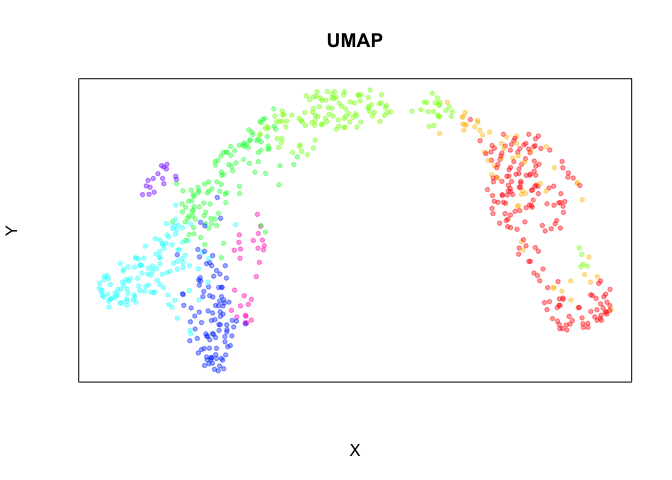
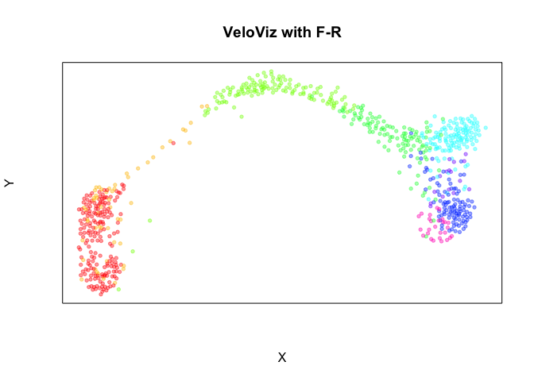
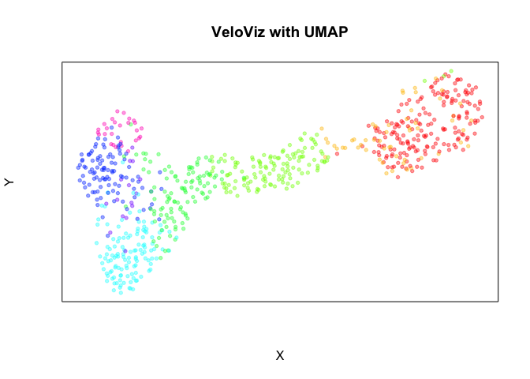
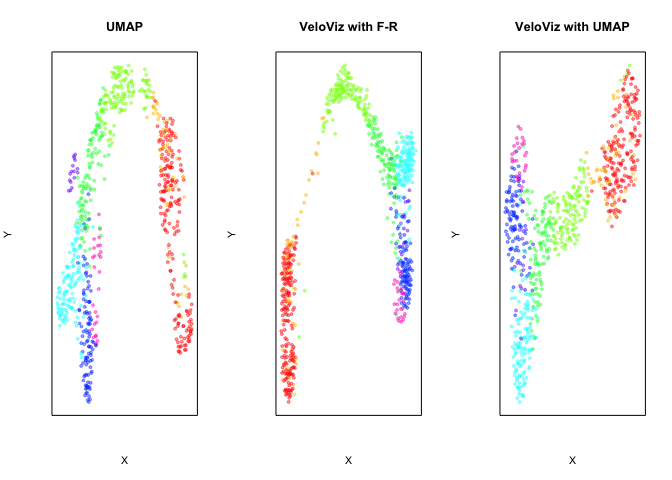
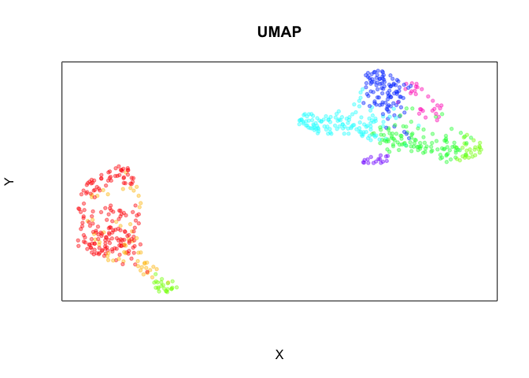
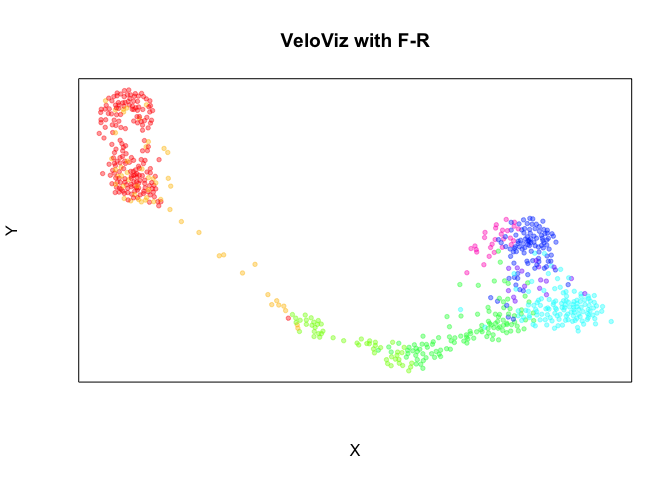
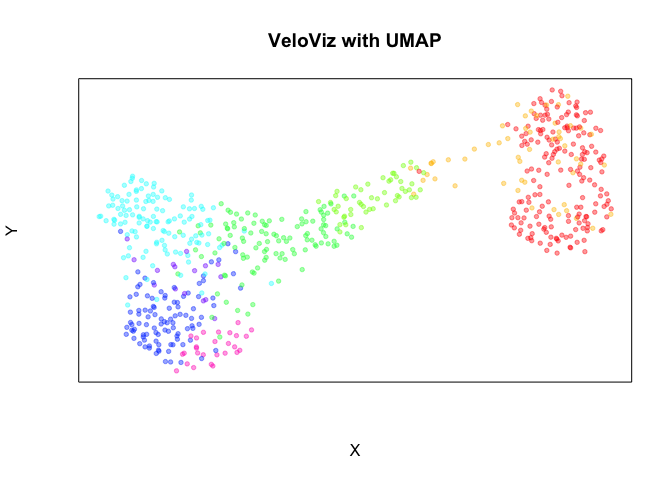
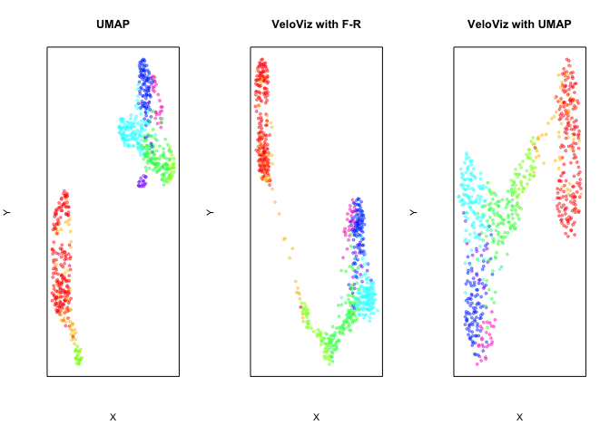

In this example, we will use Veloviz to produce a velocity-informed 2D
embedding and will then pass the computed nearest neighbor data into
UMAP. This is useful to users who want to use common algorithms such as
t-SNE and UMAP to layout their embedding. We will use the pancreas
endocrinogenesis dataset in this example.

First, load libraries:

    library(veloviz)
    library(uwot)

Next, get pancreas data from VeloViz package:

    data(pancreas)
    clusters <- pancreas$clusters #cell type annotations 
    pcs <- pancreas$pcs #principal components used to for UMAP 
    vel <- pancreas$vel #velocity 

    #choose colors based on clusters for plotting later
    cell.cols <- rainbow(8)[as.numeric(clusters)]
    names(cell.cols) <- names(clusters)

Embed using UMAP with PCs as inputs:

    set.seed(0)
    emb.umap <- uwot::umap(pcs, min_dist = 0.5)
    rownames(emb.umap) <- rownames(pcs)

    plotEmbedding(emb.umap, colors = cell.cols, 
                  main = 'UMAP', xlab = "X", ylab = "Y")

Now, build VeloViz graph:

    curr <- vel$current 
    proj <- vel$projected

    veloviz.graph <- buildVeloviz(
      curr = curr, 
      proj = proj,
      normalize.depth = TRUE,
      use.ods.genes = TRUE,
      alpha = 0.05,
      pca = TRUE,
      nPCs = 20,
      center = TRUE,
      scale = TRUE,
      k = 20,
      similarity.threshold = 0,
      distance.weight = 1,
      distance.threshold = 0,
      weighted = TRUE,
      seed = 0,
      verbose = FALSE
    )

    emb.veloviz <- veloviz.graph$fdg_coords
    plotEmbedding(emb.veloviz, colors = cell.cols, 
                  main = 'VeloViz with F-R', xlab = "X", ylab = "Y")

Now, use UMAP to embed the velocity informed graph constructed using
VeloViz:

    veloviz.nnGraph <- asNNGraph(veloviz.graph) #converts veloviz igraph object to a format that UMAP understands 

    set.seed(0)
    emb.umapVelo <- uwot::umap(X = NULL, nn_method = veloviz.nnGraph, min_dist = 1)
    rownames(emb.umapVelo) <- rownames(emb.veloviz)
    plotEmbedding(emb.umapVelo, colors = cell.cols, 
                  main = 'VeloViz with UMAP', xlab = "X", ylab = "Y")

    par(mfrow = c(1,3))

    plotEmbedding(emb.umap, colors = cell.cols, 
                  main = 'UMAP', xlab = "X", ylab = "Y")
    plotEmbedding(emb.veloviz, colors = cell.cols, 
                  main = 'VeloViz with F-R', xlab = "X", ylab = "Y")
    plotEmbedding(emb.umapVelo, colors = cell.cols, 
                  main = 'VeloViz with UMAP', xlab = "X", ylab = "Y")

Let’s try it when there is a gap in the data. First, load the data from
the VeloViz package:

    data(pancreasWithGap)
    clusters <- pancreasWithGap$clusters #cell type annotations 
    pcs <- pancreasWithGap$pcs #principal components used to for UMAP 
    vel <- pancreasWithGap$vel #velocity 

    #choose colors based on clusters for plotting later
    cell.cols <- rainbow(8)[as.numeric(clusters)]
    names(cell.cols) <- names(clusters)

Embed using UMAP with PCs as inputs:

    set.seed(0)
    emb.umap <- uwot::umap(pcs, min_dist = 0.5)
    rownames(emb.umap) <- rownames(pcs)

    plotEmbedding(emb.umap, colors = cell.cols, 
                  main = 'UMAP', xlab = "X", ylab = "Y")

Now, build VeloViz graph:

    curr <- vel$current 
    proj <- vel$projected

    veloviz.graph <- buildVeloviz(
      curr = curr, 
      proj = proj,
      normalize.depth = TRUE,
      use.ods.genes = TRUE,
      alpha = 0.05,
      pca = TRUE,
      nPCs = 20,
      center = TRUE,
      scale = TRUE,
      k = 20,
      similarity.threshold = 0,
      distance.weight = 1,
      distance.threshold = 0,
      weighted = TRUE,
      seed = 0,
      verbose = FALSE
    )

    emb.veloviz <- veloviz.graph$fdg_coords
    plotEmbedding(emb.veloviz, colors = cell.cols, 
                  main = 'VeloViz with F-R', xlab = "X", ylab = "Y")

Now, use UMAP to embed the velocity informed graph constructed using
VeloViz:

    veloviz.nnGraph <- asNNGraph(veloviz.graph) #converts veloviz igraph object to a format that UMAP understands 

    set.seed(0)
    emb.umapVelo <- uwot::umap(X = NULL, nn_method = veloviz.nnGraph, min_dist = 1)
    rownames(emb.umapVelo) <- rownames(emb.veloviz)
    plotEmbedding(emb.umapVelo, colors = cell.cols, 
                  main = 'VeloViz with UMAP', xlab = "X", ylab = "Y")

    par(mfrow = c(1,3))

    plotEmbedding(emb.umap, colors = cell.cols, 
                  main = 'UMAP', xlab = "X", ylab = "Y")
    plotEmbedding(emb.veloviz, colors = cell.cols, 
                  main = 'VeloViz with F-R', xlab = "X", ylab = "Y")
    plotEmbedding(emb.umapVelo, colors = cell.cols, 
                  main = 'VeloViz with UMAP', xlab = "X", ylab = "Y")

